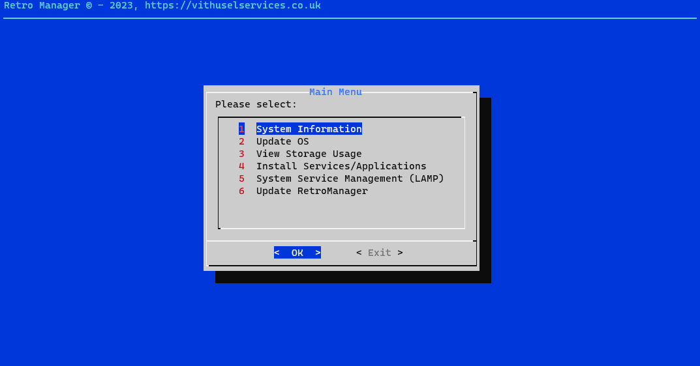

# RetroManager

## What is it? 

Add some retro flair to your workday by GUIing some terminal functions in your life. This software is still fairly new so its in heavy beta.

This is aimed at newbies who want to run day to day maintainance work but keep forgetting the different commands.

## System Requirments
- Ubuntu / Debian based OS
- Root Access
- Internet Access
## Installation

To make it easy for you to get started you can run 

```bash
  sudo curl -sSL https://git.vithuselservices.co.uk/vithusel/retromanager/-/raw/main/install.sh | bash
```
This will perform a automated installation.    
## Updating

Updates to the Retromanager can be performed via the main menu

## Roadmap
Short Term Goals - 
1. Complete basic menu layout and finalise basic tools list 
2. Basic LAMP Stack support 
3. Correct script permissions 
4. Smart install (check for existing install)
5. Built in update function 
6. Break functions into seperate repo to allow centralised functions list 
7. Improve click support. Look at options other then Dialog.
8. Add very basic versioning support

Long Term Goals - 
1. Auto configuration - Retro Manager will scan your system to see what services are installed and automatically provide management options for those applications
2. Ability to install various opensource packages and manage them
3. Server backup and restoration (with the use of some configuration file)
4. Webhook support for sending alerts about completed tasks 
5. Database Management 
6. Add smart versioning support
7. Implement smart auto update 
8. Implement smart auto management (auto update specific packages, pull code, TBC)
9. More to come
## Notice to users
Until otherwise mentioned on this repo. This software is in beta. 

## License

* Copyright (C) Vithusel Services - All Rights Reserved
* Unauthorized use, modification or distribution of this Software / Scripts, via any medium is strictly prohibited. 
* All content within this repository are proprietary and confidential. 
* All requests to be sent to Vithurshan Selvarajah <vit@vithuselservices.co.uk>


## Disclaimer

Several components of this software / script call home to update and provide metrics.

For support, email support@vithuselservices.co.uk
